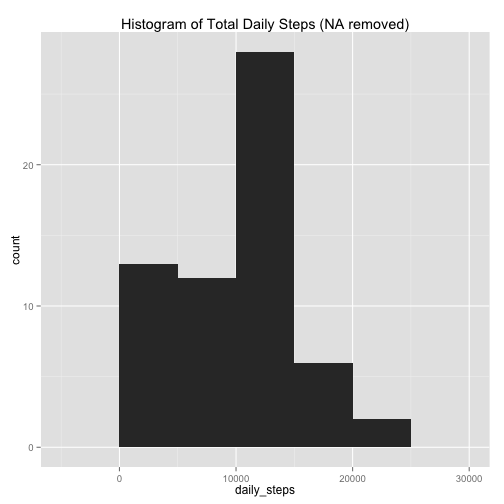
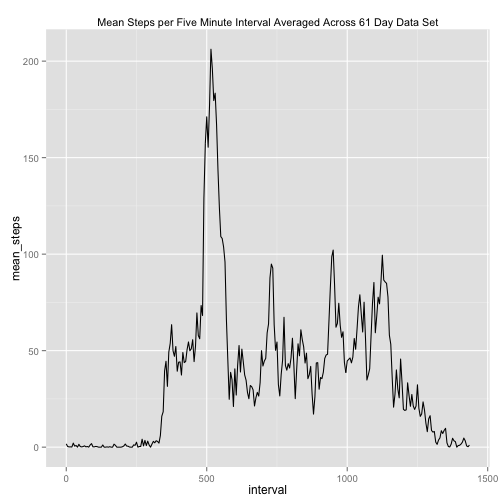
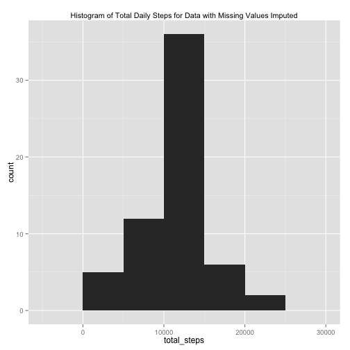
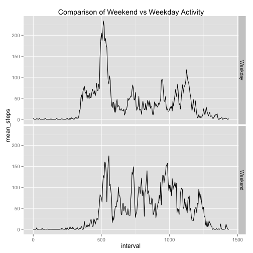

## Loading and preprocessing the data

The data are loaded using read.csv in R.


```r
      activity<-read.csv("activity.csv",stringsAsFactors=FALSE)
```

The dates are stored in YYYY-MM-DD format as character stings. It will be convenient to transoform the dates int POSIX format for later precessing of dates. This is accomplished using the the **dplyr** function **mutate** and the **lubridate** function **ymd**. 

To simplify plotting and ensure an uniform set of intervals we convert interval names to minutes rather than the hhmm format used in the data set. For example, the interval denoted by 835, is converted to 8*60 + 35 = 515. So 8:35 AM corresponds to minute 515. 


```r
      library(dplyr)
      library(lubridate)
      library(ggplot2)

      activity<-mutate(activity,date=ymd(date),interval=sapply(interval,function(x) (x%/%100)*60+x%%100))
```


## What is mean total number of steps taken per day?

1. We caluclate the number of steps taken in each day and plot a histogram.


```r
activity%>%
      group_by(date)%>%summarize(daily_steps=sum(steps,na.rm=TRUE))->tmp
ggplot(tmp,aes(x=daily_steps))+geom_histogram(binwidth=5000) + labs(
      title="Histogram of Total Daily Steps (NA removed)")
```

 

2. We calculate the mean and median of total number of steps taken per day over the 61 days of
observations.


```r
mean(tmp$daily_steps) -> mean_daily_steps
median(tmp$daily_steps) -> median_daily_steps
```


Mean Total Steps per Day | Median Total Steps per Day
---|---
9354.23 | 10395

## What is the average daily activity pattern?

We are interested in looking at each five minute interval averaged over the 61 days. By plotting thes averages we will get a view of an "average" day of activity. We will ignore NA values for the purposes of this calculation.

Noting that there are 288 five minute intervals in a day (1440 min/day / 5 min/interval = 288 intervals) we can plot the average number of steps for each five minute interval. The calcuation is performed by grouping over intervals and then using the **summarize** function from **dplyr** to calculate the mean of all measurements for that interval, i.e., average of 61 days. 

1. We present a time series plot of the 5-minute interval (x-axis) and the number of steps taken, averaged across all days (y-axis)

 

```r
activity %>% 
      group_by(interval)%>%
      summarize(mean_steps=mean(steps,na.rm=T))->tmp
      ggplot(tmp,aes(x=interval,y=mean_steps))+geom_line()+labs(title="Mean Steps per Five Minute Interval Averaged Across 61 Day Data Set") + theme(plot.title=element_text(size=rel(.9)))
```

 

2. To find the interval with the maximum average number of steps. We execute the following code.


```r
      tmp[tmp$mean_steps==max(tmp$mean_steps),1]->tmax
      tmax
```

```
## Source: local data frame [1 x 1]
## 
##   interval
## 1      515
```

*So the 5 minute interval which on averages across the 61 days observed contains the maximum number of steps begins at 515 minutes, i.e, 8:35  AM.*


## Imputing missing values

1. The number of missing values in the data set may be computed by:


```r
sum(is.na(activity$steps))
```

```
## [1] 2304
```

*So 2304 values out of 17568 or 13.11% are missing values.*

2. The strategy we adopt for replacing (imputing) missing values is to replace the mising value at a given interval with the mean value of steps taken in that interval across all days. In the case that the value is missing for all 61 days it is replaced by zero, since the mean across all days is taken with na.rm=TRUE.

3. We creaate a new dataset using the stategy described in item 2. We do this by first calculating the average of total steps for each interval across the 61 days. This gives 288 interval values. Next we determine the location of the missing values in the original data set of 17568 observations. We replicate the list 288 averaged step values 61 times. The replacement is accomplished by indexed assignment using the logical indices of the NA values. These steps are carried out in the following code.


```r
# new imputation code, the idea is ot replace NA values with
# the corresponing interval averaged over the 61 days. Averaging
# with na.rm = TRUE, will gurantee that the NA will be removed,
# replace with 0 if all the corresponding intervals are zero.

# first compute the average vector, we round the 
# interval means so as to get an integer value tu
# use in replacement

activity%>%
      group_by(interval)%>%
      summarize(mean_steps=round(mean(steps,na.rm=TRUE)))->tmp
# tmp is a 288 observations of 2 variables, interval and step.

# now we need to extract the indexes of the NA step observations
# in the activity data frame. this will be a logical vector

nandx<-is.na(activity$steps)

# replicate the tmp vector of averages 61 times

y<-rep(tmp$mean_steps,61)

# replace the NA values with the correponding average

act_imputed<-activity

act_imputed$steps[nandx]<-y[nandx]
```

4. We make a histogram of the total number of steps taken each day, then we calculate and report the mean and median for the total number of steps taken per day. 


```r
 act_imputed %>%
            group_by(date) %>%
            summarize(total_steps=sum(steps,na.rm=TRUE))%>%
      ggplot(aes(x=total_steps))+geom_histogram(binwidth=5000)+labs(title="Histogram of Total Daily Steps for Data with Missing Values Imputed")+theme(plot.title=element_text(size=rel(.9)))
```

 

For comparison we display the histogram computed without missing values imputed.


```r
 activity%>%
            group_by(date) %>%
            summarize(total_steps=sum(steps,na.rm=TRUE))%>%
      ggplot(aes(x=total_steps))+geom_histogram(binwidth=5000)+labs(title="Histogram of Total Daily Steps for Data with Missing Values Not Replaced")+theme(plot.title=element_text(size=rel(.9)))
```

 

The histograms show differnces  between the two data sets. In particular note that there are more low values for daily steps,  imuputing values as positive values increases the bin counts for various ranges of step counts. 

To investigate further we calculate the mean and median for both data sets. 


```r
act_imputed %>%
            group_by(date) %>%
            summarize(total_steps=sum(steps,na.rm=TRUE))->totact_imputed

activity %>%
            group_by(date) %>%
            summarize(total_steps=sum(steps,na.rm=TRUE))->totact
mean_steps_imputed=mean(totact_imputed$total_steps)
mean_steps=mean(totact$total_steps)
median_steps_imputed=median(totact_imputed$total_steps)
median_steps=median(totact$total_steps)
```

Statistic | Original Data | Data with NAs Imputed
---|---|---
Mean Steps | 9354.23 | 10765.64
Median Steps | 10395 | 10762

When we impute NA values we replace the NA values by positive integers. In the sum, those NA values we effectively zero since we used the na.rm=TRUE option to sum. Thus the estemated total number of steps when NAs are imputed will increase. The mean and the median may either increase or decrease depending on the number of NAs replaced and the magnitude of the replacement. In this case both the mean and the median increased with imputation.

## Are there differences in activity patterns between weekdays and weekends?


1. We classify dates as Weekend days or Weekday days. This is accomplished using the mutate function from **dplyr** and the **weekdays** function from the **base** package. A new varible is added to the activity frame labeling each row as either a "Weekday" or a "Weekend". This is done using the **mutate** function from **dplyr**. 

2. The data are grouped and summarized by chaining the **group_by** function with **summarize** both from **dplyr**. The data are plotted in separate facets for day_type using **qplot** from **ggplot2**.


```r
# classify days as "Weekend" if the day of the week is "Saturday" or "Sunday"
# and "Weekday" other wise.

actW<-mutate(activity,day_type=ifelse(weekdays(date)=="Saturday"|weekdays(date)=="Sunday","Weekend","Weekday"))

actW%>%
      group_by(day_type,interval)%>%
      summarize(mean_steps=mean(steps,na.rm=TRUE))->tmp
qplot(interval,mean_steps,data=tmp,geom="line",facets=day_type~.)+labs(title="Comparison of Weekend vs Weekday Activity")
```

 

Note there is a noticeable difference between weekend and weekday data. Activity starts later in the day on weekends, perhaps reflecting a tendancy to "sleep in", further there is more activity (higher mean steps per interval) in the afternoon, perhaps reflecting increased phsical activity on the weekend. The lower activity in the aftenoons could be reflective of the sedentary nature of work during the week.

